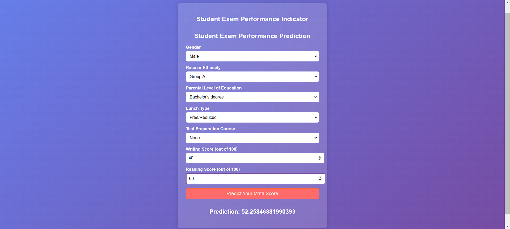

# Student Performance Prediction

This project aims to predict student performance based on various factors using machine learning models. It provides a comprehensive solution for data ingestion, transformation, model training, and prediction through well-structured components and pipelines.

 


## Overview

Predicting student performance is crucial for educational institutions to identify at-risk students and provide timely interventions. This project leverages machine learning techniques to analyze student data and predict their performance. The project follows a modular design, making it easy to understand, maintain, and extend.

## Features

- **Data Ingestion:**  Handles loading data from using `data_ingestion.py`.
- **Data Transformation:**  Performs data cleaning, preprocessing, and feature engineering using `data_transformation.py`.
- **Model Training:**  Trains machine learning models using `model_trainer.py` with configurable hyperparameters.
- **Prediction Pipeline:**  Provides a streamlined pipeline for making predictions on new data using `predict_pipeline.py`.
- **Modular Design:**  Organized into reusable components and pipelines for easy maintenance and extension.
- **Logging and Exception Handling:**  Implements robust logging and exception handling for better monitoring and debugging.

## Installation

1. Clone the repository:
   ```bash
   git clone [https://github.com/YOUR_USERNAME/Student-Performance-Prediction.git]

2. Create a virtual environment (recommended):

   ```bash
   python3 -m venv venv
   venv\Scripts\activate

3. Install the dependencies:   

   ```bash
   pip install -r requirements.txt

4. Run the flask application:
   ```bash
   python app.py
